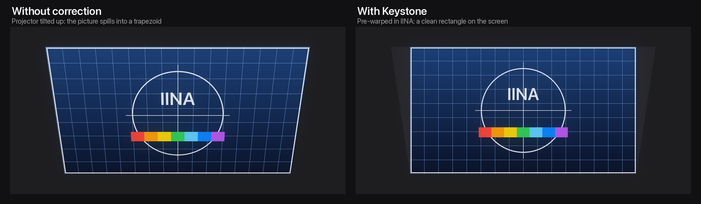
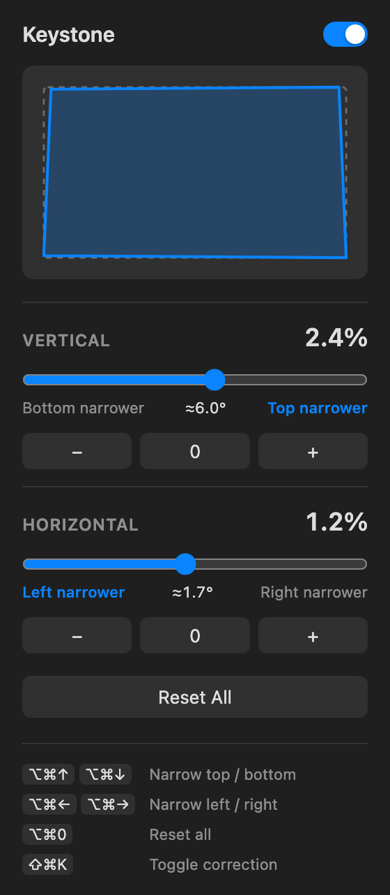

# Keystone for IINA

[](LICENSE)


An [IINA](https://iina.io) plugin that corrects keystone distortion when your projector is not aimed straight at the screen. Tilt the projector up, put it off to the side, and square the picture back up from the sidebar or the keyboard while the video keeps playing.



Portable projectors often have poor or no built-in keystone correction, and changing it means digging through an on-device menu every time the projector moves. Keystone does the correction in the player instead, so you can adjust it in real time without touching the projector.

## Features

- **Vertical and horizontal correction** with a perspective-correct warp, not a simple squeeze
- **Sidebar tab** with a live preview of the corrected shape, sliders and fine-step buttons
- **Keyboard shortcuts** for every adjustment, with the result shown on screen
- **Tilt angle estimate** next to each value, based on your projector's throw ratio
- **Remembers your settings** across files, windows and restarts
- **Works with hardware decoding** by switching to copy-back mode only while a correction is active
- **Video only**: IINA's interface, subtitles and OSD are not warped

## Installation

Requires IINA 1.4.0 or newer.

In IINA, open **Settings → Plugins → Install from GitHub…** and enter:

```
lenadweb/iina-plugin-keystone
```

Then make sure **Keystone** is switched on in the plugin list. IINA checks this repository for updates automatically.

To install manually, download `Keystone-<version>.iinaplgz` from the [latest release](https://github.com/lenadweb/iina-plugin-keystone/releases/latest) and open it with IINA.

## Usage

Open a video and adjust until the edges of the picture line up with your screen.



| Action | Shortcut |
|---|---|
| Narrow the top edge | <kbd>⌥</kbd><kbd>⌘</kbd><kbd>↑</kbd> |
| Narrow the bottom edge | <kbd>⌥</kbd><kbd>⌘</kbd><kbd>↓</kbd> |
| Narrow the left edge | <kbd>⌥</kbd><kbd>⌘</kbd><kbd>←</kbd> |
| Narrow the right edge | <kbd>⌥</kbd><kbd>⌘</kbd><kbd>→</kbd> |
| Reset all | <kbd>⌥</kbd><kbd>⌘</kbd><kbd>0</kbd> |
| Turn correction on or off | <kbd>⇧</kbd><kbd>⌘</kbd><kbd>K</kbd> |

Every command is also available in the **Plugin** menu in the menu bar, next to the shortcut that is actually assigned. If one of the default combinations is already taken, Keystone picks a free fallback, and the menu and sidebar always show the one in use.

Choose **Plugin → Show Keystone Panel** to open the Keystone tab in IINA's plugins sidebar. It has a live outline of the corrected picture, a slider for each axis, buttons for fine steps and a master switch. The same sidebar is also available from **Plugin → Show Plugins Panel**.

**Which edge to narrow?** Narrow whichever edge of the picture is too wide on the screen:

- Projector below the screen, tilted up: narrow the **top**.
- Projector above the screen or ceiling-mounted, tilted down: narrow the **bottom**.
- Projector to the left of the screen, turned right: narrow the **right** edge.
- Projector to the right of the screen, turned left: narrow the **left** edge.

<br clear="right" />

## Settings

**IINA → Settings → Plugins → Keystone**

| Setting | Default | Description |
|---|---|---|
| Adjustment step | 0.1 % | How much each shortcut or stepper button changes the correction |
| Projector throw ratio | 1.2 : 1 | Only used to estimate the tilt angle shown in the sidebar and OSD |
| Copy-back hardware decoding | On | Switches `hwdec` to `auto-copy` while a correction is active and restores it afterwards |

## How it works

Keystone adds a single labelled FFmpeg filter chain to mpv:

```
pad=iw+4:ih+4:2:2:black,
perspective=x0=W*0.0200:y0=H*0.0000:x1=W*0.9800:y1=H*0.0000:x2=W*0.0000:y2=H*1.0000:x3=W*1.0000:y3=H*1.0000:sense=destination,
crop=iw-4:ih-4
```

- `perspective` maps the frame onto the corrected quadrilateral with a true projective transform, so straight lines stay straight and spacing is compressed the way the projector stretches it.
- `pad` adds a thin black border first, so the area outside the picture is filled with black instead of smeared edge pixels.
- `crop` removes that border again, so the output keeps the source resolution and IINA never resizes the window.

The chain is labelled `@keystone`, so it coexists with any other filters you use, and turning the correction off removes it completely.

The tilt estimate comes from the projection geometry: for a correction of *k* per side and a half field of view *α*, the tilt is `atan(k / ((1 − k) · tan α))`, where `α` is derived from the throw ratio and a 16:9 image.

## Limitations

- The filter runs on the CPU. Correction is effortless at 1080p. With high bitrate 4K content, slower Macs may drop frames.
- Frames have to be copied back from the GPU, so hardware decoding runs in copy-back mode while a correction is active.
- The picture is warped within the video frame. With letterboxed content, such as a 2.39:1 film on a 16:9 projector, the black bars are corrected along with the image, but the window itself stays rectangular.
- Correction reduces the effective resolution slightly on the narrowed side. This is true of every digital keystone correction, including the one built into projectors.

## Development

```bash
git clone https://github.com/lenadweb/iina-plugin-keystone.git
cd iina-plugin-keystone
npm install      # type definitions for editor completion
npm run link     # load the working copy into IINA as a development plugin
```

After linking, open **IINA → Settings → Plugins** and switch Keystone on. Use **Plugin → Reload All Plugins** or restart IINA to pick up changes.

```
src/keystone.js      geometry, filter builder and tilt estimate
src/shortcut.js      formats key bindings for display
src/index.js         IINA wiring: menu, shortcuts, mpv filter, preferences, sidebar messages
ui/sidebar/          sidebar tab
ui/preferences.html  settings page
```

### Releasing

1. Bump `version` and increment `ghVersion` in `Info.json`, and update `CHANGELOG.md`.
2. Run `npm run pack` to build `build/Keystone-<version>.iinaplgz`.
3. Push to `main`, then create a GitHub release tagged `v<version>` with the `.iinaplgz` attached.

IINA compares `ghVersion` with `Info.json` on `main` to offer updates, and installs the `.iinaplgz` from the latest release.

## License

[MIT](LICENSE)
